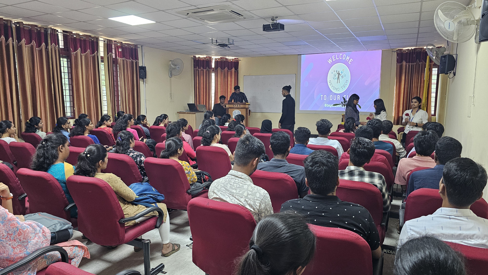
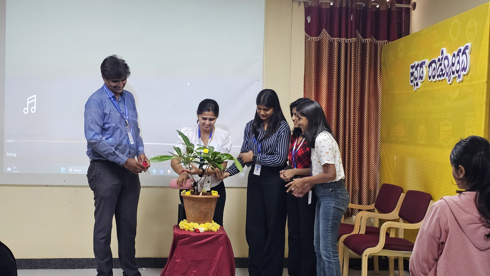

# Club Beyond Tech

## About Us

### Mission and Vision Statement
Our mission is to foster a collaborative and innovative tech community that empowers individuals to explore, learn, and excel in the world of technology. We envision a future where every member of our club contributes to the global tech landscape.

### Club History and Founding Members
Club Beyond Tech was founded in october of 2023 by a group of passionate individuals. Since then, we have grown into a vibrant community dedicated to technological advancement and knowledge sharing.

### Club Achievements and Milestones
- On 17th of november 2023, we conducted our first workshop "ADIGHAM" which focused on career guidance and latest technologies in the field of computer science
- In the future we plan to conduct several other workshops on various topics and build projects across various domains

## Membership Information
- We are thrilled to announce that Club Beyond Tech currently boasts a vibrant community of 10 dedicated members who share a passion for technology and innovation. Our close-knit group has been actively engaged in collaborative projects, exclusive workshops, and networking events. As we celebrate our current membership, we are excited about the prospect of expanding our community even further. Club Beyond Tech is ready to welcome new members who are eager to explore, learn, and contribute to the dynamic world of technology. Join us on this exciting journey as we grow and shape the future of our tech community together.

### Benefits of Joining
- Access to exclusive tech workshops and seminars
- Networking opportunities with seniors and juniors
- Collaborative projects and hands-on learning experiences

### Membership Criteria and Process
- The membership criteria will be shared shortly 

### Testimonials
> "Joining Club Beyond Tech was a game-changer for my career in tech. The community support and learning opportunities are unparalleled!" - shreya girish

## Events/Projects
- will begin shortly

### Calendar of Upcoming Events
- workshop in january

### Event Photos and Highlights

## Get Involved

### Ways for Members to Contribute
- [List Ways to Contribute]

### Volunteer Opportunities
- [List Volunteer Opportunities]

### Project Collaboration Details
If you're interested in collaborating on a project, reach out to [Project Coordinator's Name].

## Blog/News Section

### Club Updates
- [Latest Club News]

### Tech-related Articles or Insights
- [Links to Tech-related Articles]

### Member Spotlights or Interviews
- [Member Spotlight 1]
- [Member Spotlight 2]

## Resources

### Useful Links or Tools
- [List Useful Links or Tools]

### Tutorials or Guides Created by Members
- [Links to Tutorials or Guides]

### Tech-related Resources
- [Additional Tech Resources]

## Contact Us

### Contact Information
For inquiries, email us at club.beyondtech@gmail.com

### Social Media Links
- [Facebook](link_to_facebook)
- [Twitter](link_to_twitter)
- [LinkedIn](link_to_linkedin)

### Feedback or Inquiry Form
[Link to Feedback Form]

## Gallery

### Photo Gallery

### Videos or Multimedia Content
[Link to Club Beyond Tech YouTube Channel]

## FAQs

### Commonly Asked Questions and Answers
- [List FAQs]

### Information for Prospective Members
- [Information for Prospective Members]

## Testimonials

### Positive Feedback from Members
> "Club Beyond Tech has been a source of inspiration and learning. The camaraderie among members is truly remarkable!" - [Member Name]

### Success Stories or Impactful Experiences
- [Success Story 1]
- [Success Story 2]

## Footer
[Copyright Information and Any Additional Details]
